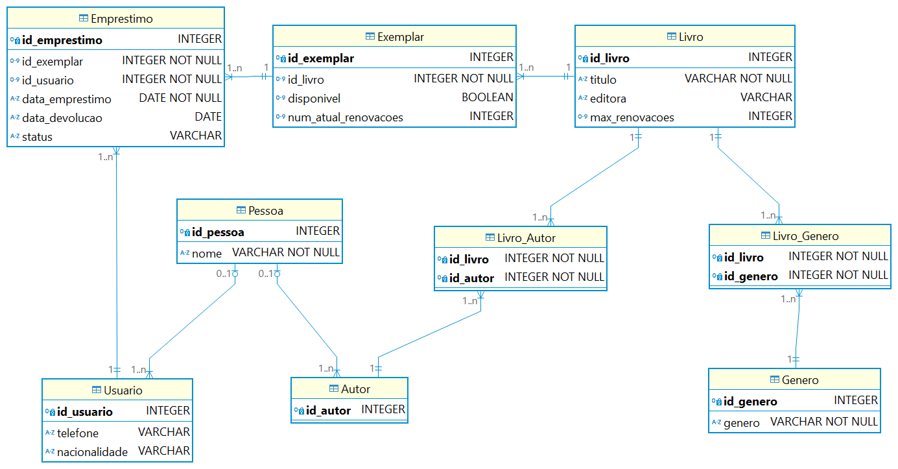

# WoMakers Code 🦋 - Bootcamp BackEnd - Python Django (SQUAD - ENIAC)

🦋 Este repositório contém o Desafio SQL desevolvido pelo Squad ENIAC durante o Bootcamp de Python & Django oferecido pela WoMakersCode. O objetivo deste bootcamp é fornecer uma base sólida em Python e Django, capacitando as mulheres a desenvolverem aplicações web completas 🦋

## Desafio Banco de Dados

### 📜 Descrição

Este desafio abrange conceitos fundamentais de Banco de Dados, como criação de tabelas, inserção de dados, consultas SQL, atualizações e exclusões.
  
#### 📚 Exercício  Gerenciamento de Biblioteca:

📋 **Baseado no exercício de Gerenciamento de Biblioteca. Vamos criar agora o banco de dados do exercício escolhido.**

- 1️⃣. Criação das Tabelas:
    - Utilizando SQL, crie as tabelas necessárias para armazenar as informações do sistema. Certifique-se de definir as chaves primárias e estrangeiras conforme apropriado.

- 2️⃣. Inserção de Dados:
    - Insira dados de exemplo nas tabelas para simular um ambiente de biblioteca. Certifique-se de incluir uma variedade de livros, autores e editoras.

- 3️⃣. Consultas SQL, escreva consultas SQL para realizar as seguintes operações:
    - Listar todos os livros disponíveis.
    - Encontrar todos os livros emprestados no momento.
    - Localizar os livros escritos por um autor específico.
    - Verificar o número de cópias disponíveis de um determinado livro.
    - Mostrar os empréstimos em atraso.

- 4️⃣. Atualizações e Exclusões:
    - Escreva consultas SQL para atualizar e excluir registros do banco de dados, por exemplo, para marcar um livro como devolvido ou remover um autor

## 👥 SQUAD ENIAC - Integrantes 

- Ana Julia Rauber - [GitHub](https://github.com/anajuliarauber) - [Likedin](https://www.linkedin.com/in/ana-julia-rauber/);
- Angelica Conceição Salvino da Silva - [GitHub](https://github.com/AngelicaSalvino) - [Likedin](https://www.linkedin.com/in/angelica-salvino/);
- Caroline Souza Camargo - [GitHub](https://github.com/Caroline-Camargo) - [Likedin](https://www.linkedin.com/in/caroline-souza-camargo-023b54164/);
- Fabiana Maria Ignácio da Silva - [GitHub](https://github.com/Ignacio-fabianamaria) - [Likedin](https://www.linkedin.com/in/fabianaignacio/);
- Kassia do Espirito Santo - [GitHub](https://github.com/KassiaES) - [Likedin](https://www.linkedin.com/in/kassia-es);
- Laysa Alexia Lima Cipriano - [GitHub](https://github.com/LayCipriano) - [Likedin](https://www.linkedin.com/in/lay-cipriano/);
- Marina Cesconeto dos Santos (líder do squad) - [GitHub](https://github.com/marina6coneto) - [Likedin](https://www.linkedin.com/in/marina-cesconeto-dos-santos-a17563216/);
- Natalia Gomes Vitório - [GitHub]() - [Likedin]();
- Rosana de Souza Brito - [GitHhub](https://github.com/RosanaBrito) - [Likedin](https://www.linkedin.com/in/rosanadesouzabrito/);

### 🤝 Divisão das Tarefas

A divisão foi realizada de forma que cada etapa fosse concluída antes do início da etapa seguinte. Dessa forma, as meninas com mais disponibilidade de tempo no início do projeto começaram pela primeira etapa, e assim por diante. Dividimos uma etapa para duas meninas.

- 1️⃣. Criação das Tabelas: Carol e Marina
- 2️⃣. Inserção de Dados: Angelica e Fabiana
- 3️⃣. Consultas SQL: Rosana e
- 4️⃣. Atualizações e Exclusões: Kassia e Ana Julia
